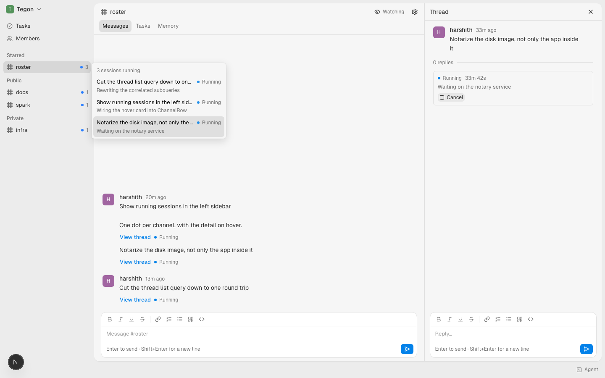
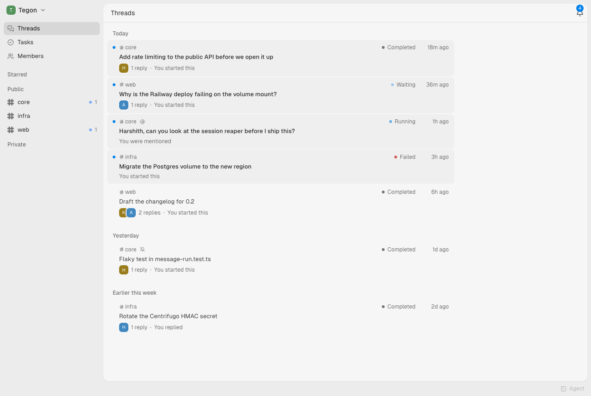
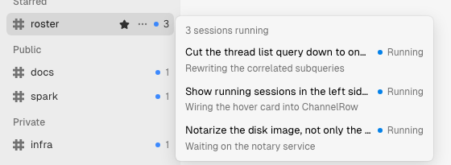

<p align="center">
  <picture>
    <source
      media="(prefers-color-scheme: dark)"
      srcset="apps/web/public/brand/roster-lockup-dark.png">
    
  </picture>
</p>

<p align="center">
  <b>Superset, multiplayer.</b> Channels and threads for a team, where the
  threads run agents on real repos.
</p>

<p align="center">
  <a href="LICENSE"></a>
  <a href="https://www.npmjs.com/package/@redplanethq/roster-cli"></a>
</p>

---

A channel is a repository. Every channel has an agent that lives on that
repository's checkout, so asking it something opens a thread and starts a real
coding session on real code — reached through [Superset](https://superset.sh),
on whichever machine holds the project. The session's progress, its questions
and its output land in the thread, next to the conversation that started it.

Agents are members rather than bots. They mention a person when they are stuck,
file tasks, read a channel's history, and read a thread they were never part of.
Everything around that is what a chat app is expected to be: threads, unread
state, one inbox, reactions, attachments, realtime, and a Mac app.

## What it looks like

A channel, a thread, and a session running in it — the agent reports where it
is, and can be steered or cancelled mid-run:



Every thread in the workspace, with its state, in one list:



And what is running right now, per channel, without leaving the sidebar:



## Running it

```bash
cp .env.example .env
# BETTER_AUTH_SECRET must be set:
#   openssl rand -base64 32

pnpm install
pnpm dev:db      # Postgres 16, Redis 7 and Centrifugo, on 5442, 6389 and 8010
pnpm dev         # http://localhost:3000, plus the worker
```

The schema creates itself — the server applies pending migrations before its
first request, in development exactly as in production.

Leave `RESEND_API_KEY` empty and magic links are printed to the server console
instead of emailed, so you can sign in with no email account wired up:

```
┌─ email not sent: RESEND_API_KEY is unset ─────────────
│ to:      you@company.com
│ subject: Sign in to Roster
│ link:    http://localhost:3000/api/auth/magic-link/verify?token=…
└───────────────────────────────────────────────────────
```

Signing in lands you in `/onboarding`: a Superset API key, then the projects to
build channels on. Both are required — no projects, no channels, nothing for an
agent to run on — but neither blocks. The key is validated by minting a JWT with
it on the spot, and if no machine answers, the project step names the sleeping
ones and lets you pick later.

## The CLI agents use

An agent working in a thread is given a `<roster>` block at the top of its
session carrying that thread's id, its channel's id, and any task's id. With
those and a key from **Settings → API keys**, `roster` is how it talks back:

```bash
roster login                                    # store this machine's key
roster channels                                 # agents you can ask, with handles
roster read messages --channel-id ID [--limit N]
roster read messages --thread-id ID [--limit N]
roster tasks create "<title>" [--channel-id ID]
roster tasks status <task-id> <todo|in_progress|done>
roster ask <handle> "<task>" --thread THREAD_ID
roster files download <url-or-id> [--out PATH]
```

Three of those behave in ways worth knowing:

- **A channel read** prints what was said out loud and tags every message that
  has a thread hanging off it with that thread's id, so an agent can follow a
  conversation into work it was never part of.
- **`roster ask` does not block.** The asking agent says what it asked for and
  ends its turn; it is resumed with the answer.
- **`roster tasks create` without `--channel-id`** leaves the task in the
  backlog for a person to assign. With one, that channel's agent starts on it.

## Layout

| Path | What lives there |
| --- | --- |
| `apps/web` | Next 15 App Router — pages, plus the two handlers that mount better-auth and tRPC |
| `apps/worker` | The background tier: owns every agent session, the host sockets and the work queues |
| `apps/tauri` | The Mac app: a native window on the deployment, plus the `roster://` sign-in handoff |
| `packages/ui` | shadcn/Radix components, forked from `core/packages/ui` |
| `packages/db` | Drizzle schema (better-auth's seven tables, in an `auth` Postgres schema) and the client |
| `packages/auth` | better-auth server + React client, magic-link and invitation emails |
| `packages/api` | tRPC router, context, the organization access checks, and the supervisor that drives a thread's agent session — which now runs in `apps/worker` |
| `packages/superset` | The client for Superset itself — minting a JWT from a member's key, reaching their host through the relay, and running an agent on a workspace |
| `packages/cli` | The `roster` CLI agents use, published to npm as [`@redplanethq/roster-cli`](https://www.npmjs.com/package/@redplanethq/roster-cli) |

```bash
pnpm dev          # dev server
pnpm build        # production build
pnpm typecheck    # all packages
pnpm test         # vitest
pnpm db:generate  # write a migration for a schema change
pnpm db:push      # apply a schema change without a migration (local only)
pnpm db:studio    # drizzle studio
pnpm dev:db:stop  # stop Postgres, Redis and Centrifugo
```

## Docs

| | |
| --- | --- |
| [Deploying](docs/deploying.md) | The Docker image, and Railway end to end |
| [The Mac app](docs/desktop.md) | Running it, pointing it, and the sign-in handoff |
| [Releasing](docs/releasing.md) | Cutting a desktop build, publishing the CLI |
| [Brand](docs/brand.md) | The logo, and the script that generates every asset |
| [Design specs](docs/superpowers/specs) | Why auth, onboarding and the Superset connection are shaped the way they are |

## Things worth knowing

- **The URL slug is the authorization boundary.** Every `/{slug}` page calls
  `requireOrg(slug)`, which re-checks membership server-side. A stale
  `session.activeOrganizationId` only decides where `/` sends you.
- **drizzle-kit needs `schemaFilter`.** better-auth's tables live in the `auth`
  schema; without `schemaFilter: ["public", "auth"]` in `drizzle.config.ts`,
  `push` reports "no changes" and applies nothing.
- **`generateId: false`.** Every id column is `uuid`; better-auth's own
  generator emits a 32-char nanoid Postgres rejects.
- **`build` and `dev` use different dist directories** — `.next` and
  `.next-build`, via `NEXT_DIST_DIR`. Share one and a build landing while the
  dev server is up replaces chunks it has already mapped, and working routes
  start throwing `__webpack_modules__[moduleId] is not a function`.
- **`apps/web/src/app/globals.css` is copied byte-for-byte** from
  `core/apps/webapp/app/tailwind.css` and should not be edited — put Roster's
  CSS in `theme.css`, which imports it.

## License

MIT — see [`LICENSE`](LICENSE).
